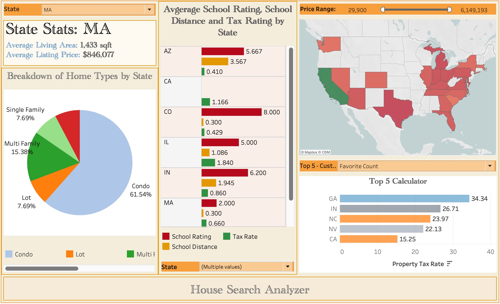
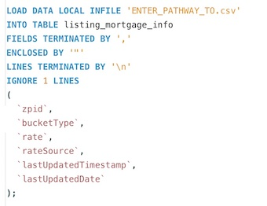
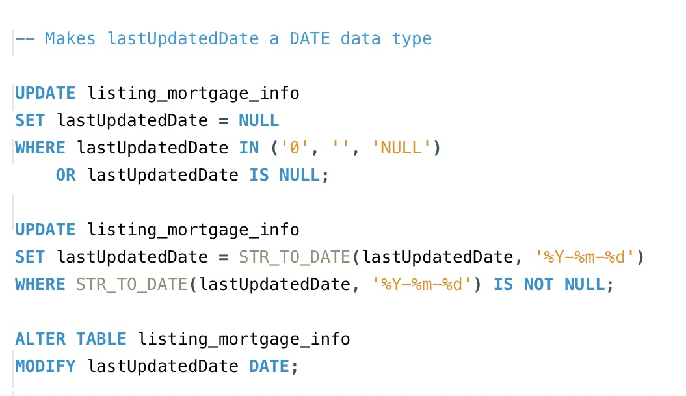
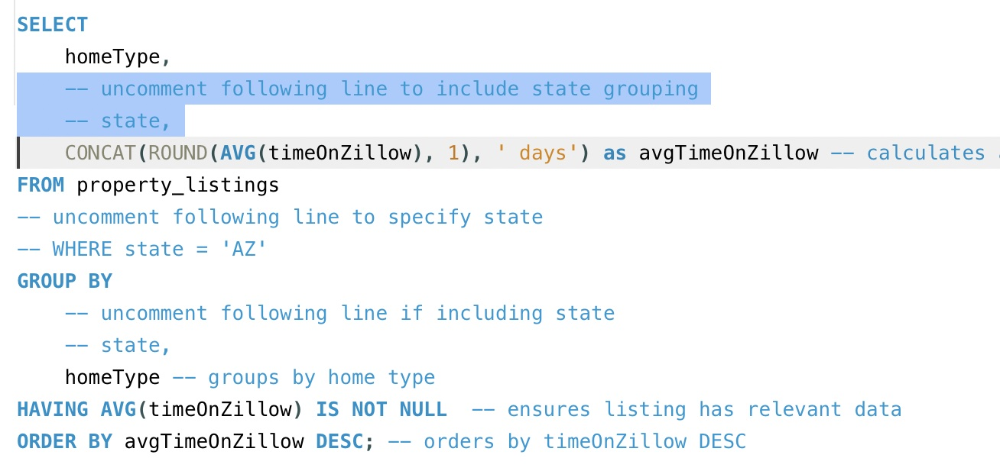
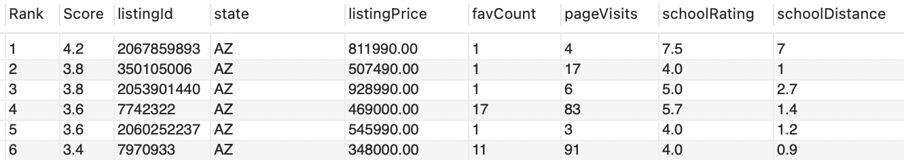
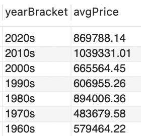
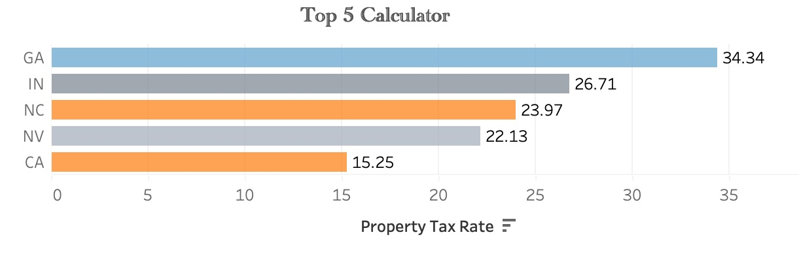
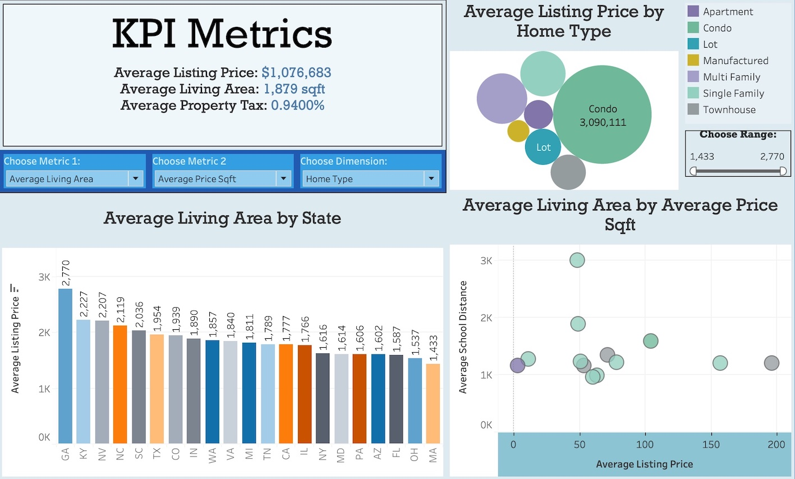

# SQL Meets Suburbia: A Zillow-Powered Data Deep Dive

Ever wondered what insights lie behind Zillow’s mountain of real estate listings? This project tackles that question by transforming raw CSVs into a structured SQL database and then into interactive Tableau dashboards. From price trends to school proximity, I used MySQL and Tableau to explore the dynamics of the U.S. housing market—one query at a time.  

  

To get the most out of the data, I used CTEs, window functions, aggregate logic, and more—turning raw listings into real business insights. From there, the datasets were imported into Tableau to create interactive dashboards and a "House Search Analyzer" to help determine market conditions based on individual preferences. 

  

The dataset and schema were obtained from [this Kaggle dataset](https://www.kaggle.com/datasets/tonygordonjr/zillow-real-estate-data) and extensively cleaned, indexed, and relationally optimized in the accompanying schema setup script.

## Table of Contents

I. Included Files \
II. Included Datasets \
III. Installation \
IV. Areas of Analysis (SQL) \
V. Dashboard Visualizations (Tableau) \
VI. Tools Used \
VII. Conclusion \
VIII. Contact Details

## I. Included Files

    • Zillow Datasets - Original (dir zillow_datasets_OG)
    • Zillow Datasets - Cleaned (dir zillow_datasets_cleaned)
    • Zillow Import SQL Script (zillow_schema_setup.sql)
    • Zillow Schema Diagram (zillow_schema_diagram.pdf)
    • Zillow Data Wrangling (zillow_data_wrangling.sql)
    • Zillow Data Analysis Queries (zillow_analysis.sql)
    • Zillow Dashboards (zillow_tableau_story.twb)

## II. Included Datasets

    • listing_mortgage_info.csv
    • listing_nearby_homes.csv
    • listing_price_history.csv
    • listing_schools_info.csv
    • listing_subtype.csv
    • listing_tax_info.csv
    • property_tax.csv

Each of these datasets is available in its clean as well as original form. 

## III. How to Build the Database

The file zillow_schema_setup is a modifiable SQL code (zillow_schema_setup.csv) allowing one to import the datasets directly into a SQL database. Throughout this project, I employed MySQL Workbench. 

  

Next, a series of steps were taken to formulate the database, especially in adjusting it from a star schema to a snowflake schema, establishing keys and constraints, adjusting data types and adding appropriate indexes (zillow_data_wrangling.sql). 

  

If all of this code is run, then you end up with the cleaned datasets that are readily available.

## IV. What I Asked the Data

Once the data had been tidied and adjusted, I then broke down the primary queries into key domains of a business interest. Along with this, I have included large portions of modifiable code to fit individual needs. 

  

The main areas of concern are listed as follows:

    • Property Score Calculator
    • Price and Commonality by State/City
    • Factors of Property Price
    • Property Popularity
    • Properties Over Time
    • Property Status

The first part includes a score calculator that looks at a number of core KPIs in order to determine an individual score based on listing price, price comparison to the local area, online listing engagement, distance to nearby schools and the average rating of those schools. This can be modified to search by state, city, zipcode, price, school rating, school distance or listing status. 

  

From here, a number of key areas were investigated to better understand the dynamics of the real estate market, such as most expensive states, how various KPIs impact pricing, average square footage by year built, etc. 

  

Once completed, I moved onto the visualization of the data in Tableau.

## V. Dashboards and Discoveries

For the visualizations, I have focused on compiling three highly interactive and engaging dashboards. These can be found in the Tableau workbook (zillow_tableau_story.twb) as well as on my [Tableau Public](https://public.tableau.com/app/profile/analyticsbyjake).

The first dashboard is a "House Search Analyzer." It allows one to search by state, price range and home type. There is also the option to see the top performing states for certain fields. 

  

The second dashboard focuses on "Sales Performance." It allows you to search by a number of key variables using a variety of metrics. For instance, one is able to search for the "Top 10" by states based on different concerns: Total Market Volume, Average Rent Estimates, Average Listing Price and Average Living Area. 

The final dashboard addresses KPI metrics, allowing the viewer to compare metrics in real time. The variety of charts and options  here make it a very versatile and invaluable dashboard for a range of business purposes. 

  

The ultimate result is a much cleaner database that is easily navigated by the interactive elements displayed in the visualizations. 

## VI. Tools Used

• MySQL Workbench \
• VS Code \
• Tableau 

## Conclusion

This project's vast scope allowed me to include quite a degree of interactiveness to the output, a key element of responsive business practices. Of course, the data is only as good as the one who is using it, and the extent to which individuals can interact with the material might be daunting for some. The intent was to create multipurpose files for those who wish to look for specific connectsion - but might not have the know-how to access them. 

True to my style, I built this project with practicality and functionality in mind—making it useful not just to analysts, but anyone looking for insight. Not only do I work to make connections but to convey those relationships to others in a clear, concise manner. 

## VIII. Contact Info

[Linkedin](www.linkedin.com/in/jacob-maze-8a4a0772)

[Tableau Public](https://public.tableau.com/app/profile/analyticsbyjake)

[GitHub](https://github.com/AnalyticsByJake)

[Website]

